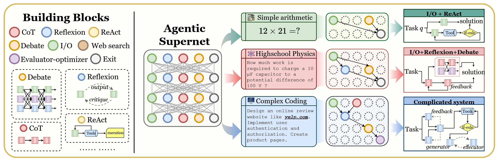
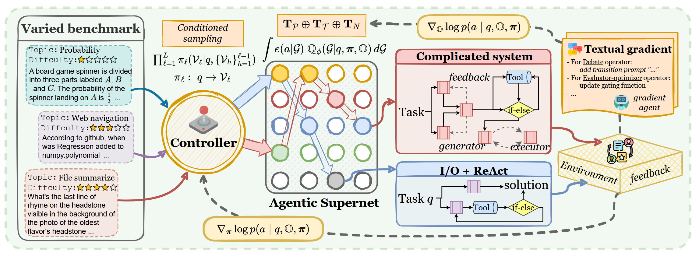

# MaAS: Multi-agent Architecture Search via Agentic Supernet

## 📰 News

- 🎉 Updates (2025-05-03) MaAS is accepted as **ICML'25 Oral (Top ~1% among 12,107 submissions)**!
- 🚩 Updates (2025-02-06) Initial upload to arXiv (see [PDF](https://arxiv.org/abs/2502.04180)).


## 🤔 What is Agentic Supernet?

We *for the first time* shift the paradigm of automated multi-agent system design from seeking a (possibly non-existent) single optimal system to optimizing a probabilistic, continuous distribution of agentic architectures, termed the **agentic supernet**. 



## 👋🏻 Method Overview

Building on this concept, we propose **MaAS**, which dynamically samples multi-agent systems that deliver satisfactory performance and token efficiency for user queries across different domains and varying levels of difficulty. Concretely, MaAS takes diverse and varying difficulty queries as input and leverages a controller to sample a subnetwork from the agentic supernet for each query, corresponding to a customized multi-agent system. After the sampled system executes the query, MaAS receives environment feedback and jointly optimizes the supernet’s parameterized distribution and agentic operators.



## 🏃‍♂️‍➡️ Quick Start

### 📊 Datasets

Please download the  `GSM8K`,  `HumanEval`, `MATH`datasets and place it in the `maas\ext\maas\data` folder. The file structure should be organized as follows:

```
data
└── gsm8k_train.jsonl
└── gsm8k_test.jsonl
└── ......
```

### 🔑 Add API keys

You can configure `~/.metagpt/config2.yaml` according to the example.yaml. Or you can configure `~/config/config2.yaml`.

```python
llm:
  api_type: "openai" 
  model: "gpt-4o-mini" 
  base_url: ""
  api_key: ""
```

### 🐹 Run the code

The code below verifies the experimental results of the `HumanEval` dataset.

```bash
python -m examples.maas.optimize --dataset HumanEval --round 1 --sample 4 --exec_model_name "gpt-4o-mini"
python -m examples.maas.optimize --dataset HumanEval --round 1 --sample 4 --exec_model_name "gpt-4o-mini" --is_test True
```

## 📚 Citation

If you find this repo useful, please consider citing our paper as follows:

```bibtex
@article{zhang2025agentic-supernet,
  title={Multi-agent Architecture Search via Agentic Supernet},
  author={Zhang, Guibin and Niu, Luyang and Fang, Junfeng and Wang, Kun and Bai, Lei and Wang, Xiang},
  journal={arXiv preprint arXiv:2502.04180},
  year={2025}
}
```

## 🙏 Acknowledgement

Special thanks to the following repositories for their invaluable code and prompt.

Our prompt is partially adapted from [ADAS](https://github.com/ShengranHu/ADAS), [AgentSquare](https://github.com/tsinghua-fib-lab/AgentSquare/tree/main), and [AFLOW](https://github.com/geekan/MetaGPT/tree/main/examples/aflow). Our code and operators are partially adapted from [AFLOW](https://github.com/geekan/MetaGPT/tree/main/examples/aflow).
